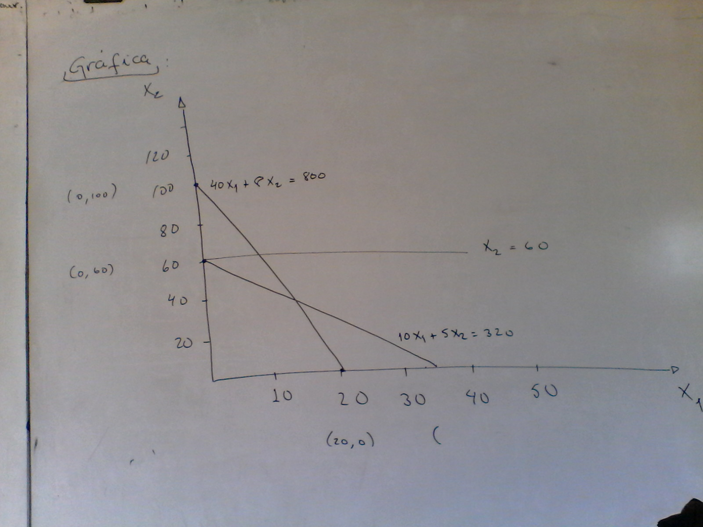

## Programación lineal 

La *programación lineal* es un método en la investigación de operaciones que involucra la planificación de actividades para obtener un resultado óptimo, esto es, obtener el resultado que mejor alcance una meta especificada (de acuerdo con el modelo matemático) entre todas las alternativas factibles.

El término *programación*, no se refiere aquí a términos computacionales, sino, en escencia es sinónimo de **planificación**.

La palabra *lineal* en este caso significa que **todas las funciones matemáticas del modelo DEBEN SER FUNCIONES LINEALES**.

Cualquier problema cuyo modelo matemático se ajuste al formato general del modelo de *Programación Lineal*, es un *Problema de Programación Lineal*.

Para estos problemas se disponen métodos de solución muy eficiente, tales como: 
- Método gráfico 
- Algoritmo de punto interior 
- Método simplex

--- 

## Solución de Problemas de Programación Lineal por el Método Gráfico

El **método gráfico** se emplea para resolver problemas que presentan **solo dos variables de decisión**. El procedimiento consiste en trazar las ecuaciones de las restricciones en un eje de coordenadas `(x1, x2)` para tratar de identificar el área de solución factible (la solución que cumple con todas las restricciones). La solución óptima del problema se encuentra en uno de los vértices de esta área de solución creada, por lo que se buscara en estos datos el valor mínimo o máximo del problema, Se analizan estos valores/datos en la función objetivo y el vértice que representa el mejor valor de la función objetivo será la solución óptima.

#### Ejemplo:

> Una compañía de auditores se especializa en preparar liquidaciones y auditorías a empresas pequeñas, tiene interés en saber cuántas auditorías y liquidaciones pueden realizar mensualmente para maximizar sus ingresos.
> Se dispone de `800` horas de *trabajo directo* y `320` horas para *revisión*.
> *Una auditoría* en promedio requiere de `40` horas de *trabajo directo* y `10` horas de *revisión* y aporta un ingreso de `$300`.
> Una liquidación de impuesto requiere de `8` horas de *trabajo directo* y `5` horas de *revisión*, produce un ingreso de `$100` y el máximo de liquidaciones mensuales disponibles es de `60`.

#### Solución:

**Objetivo: ** Maximizar los ingresos 

**Variables de decisión:**  
1. cantidad de auditorías (x1)
2. cantidad de liquidaciones (x2)

**Restricciones:**  
1. tiempo disponible de trabajo directo: 800 horas.
2. tiempo disponible de revisión: 320 horas 
3. número máximo de liquidaciones: 60.

**Maximizar:**  
`Z = 300 x1 + 100 x2`

**Condiciones:**  
`40 x1 + 8 x2 <= 800`
`10 x1 + 5 x2 <= 320 `
`x2 <= 60 `
`x1,x2 >= 0 `

**Gráfica**

